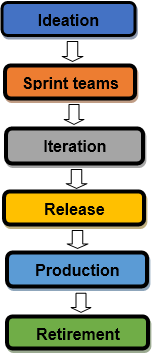

##################################################################
 Agile Process and Reality vs Theory - *where's the off-ramp?!?!*
##################################################################

.. image:: images/george_jetson_s_treadmill_dilemma.png
   :align: center
   :width: 80%
   :target: https://pre00.deviantart.net/0e98/th/pre/i/2017/172/8/7/george_jetson_s_treadmill_dilemma_by_zacharynoah92-db8ep7a.png

.. contents:: Outline

.. raw:: pdf

   SetPageCounter

The Agile Manifesto
===================

Core Concepts (paraphrased)
---------------------------

* Early and continuous delivery of value to the customer

* Harness change for the customer's competitive advantage

* Business people and developers work together daily

* Use the most effective communication tools available (f2f is "best")

* A working system is the primary measure of progress

* Agile processes must be sustainable

* Simplicity in design and implementation is essential

* Reflect on how to become more effective (each iteration)

*The Agile movement is not anti-methodology, in fact many of us want to restore credibility to the word methodology. We want to restore a balance. We embrace modeling, but not in order to file some diagram in a dusty corporate repository. We embrace documentation, but not hundreds of pages of never-maintained and rarely-used tomes. We plan, but recognize the limits of planning in a turbulent environment. Those who would brand proponents of XP or SCRUM or any of the other Agile Methodologies as "hackers" are ignorant of both the methodologies and the original definition of the term hacker.*
  
*Jim Highsmith,* `History - The Agile Manifesto`_

.. _History - The Agile Manifesto: http://agilemanifesto.org/history.html

What is an Agile Process?
=========================

* Follows the core principles laid out in the `Agile Manifesto`_

  - Iterative, collaborative, sustainable, self-reflective
  - Embraces change, customer/user-focused
  - Each iteration delivers a working product

* Takes advantage of appropriate tools/models

  - Workflow based on appropriate Agile Workflow Model(s)
  - Uses appropriate tools to facilitate the workflow

      + Software development tools
      + Test/continuous integration tools
      + Communication/collaboration tools
      + Project/operations management tools

* Communicates frequently using multiple modalities

  - Actual face-to-face mtgs
  - Text/voice/video chat
  - Tool push notifications
  - Project dashboard

.. _Agile Manifesto: http://agilemanifesto.org/principles.html

.. raw:: pdf

   PageBreak skewColumn

What is an Agile Process Model?
===============================

.. raw:: pdf

   Spacer 0 2mm

1. Ideation: Define the business scope for each of the project ideas and determine the time and set of tasks required to execute the project.

2. Creation of Sprint Teams: After identifying the project and discussion with stakeholders, the agile team members are identified and resources are allocated to execute the project.

3. Iteration: As the product goes through many rounds of improvement or iteration, the first iteration usually includes minimal functionality. Further sprints are used to develop the complete system.

4. Release: At this stage, the product is ready to pass into the production phase. The quality team tests the product functionality and any major defects are corrected.

5. Production: Ensure successful product launch and guide the users on its usage (continual support for the product after release).

.. raw:: pdf

   FrameBreak

.. raw:: pdf

   Spacer 0 25mm

.. raw:: pdf

   PageBreak cutePage

Agile Project Management
========================

`Agile project management`_ - *an incremental approach to managing projects that helps teams address and respond to change and uncertainty over the course of a project life cycle*

The core principles of agile PM are largely based on the Agile Manifesto (initially developed for software development), and emphasize:

* The importance of collaboration in fostering innovation
* The significance of feedback loops and iterative workflows in facilitating inspection and continuous improvement
* The value in embracing and responding to change over blindly following a plan

.. _Agile project management: https://www.softwareadvice.com/project-management/agile-comparison/

Artifacts
=========

:Author: Stephen L Arnold
:Role: OS / Integration / Process Engineer
:FOSS Hat: Gentoo Linux Developer
:Contact: steve@orchardsystems.com
:Revision: 0.0.2
:Date: |date|, |time| PST8PDT
:License: `CC-Attribution-ShareAlike`_
:Copyright: 2019 `Stephen Arnold`_
:Other: All other trademarks and copyrights belong to their respective owners.

.. _CC-Attribution-ShareAlike: http://creativecommons.org/licenses/by-sa/3.0/
.. _Stephen Arnold: http://github.com/sarnold

.. raw:: pdf

    Spacer 0 5mm

.. image:: images/cc3.png
   :align: left
   :width: .5in

.. |date| date::
.. |time| date:: %H:%M

